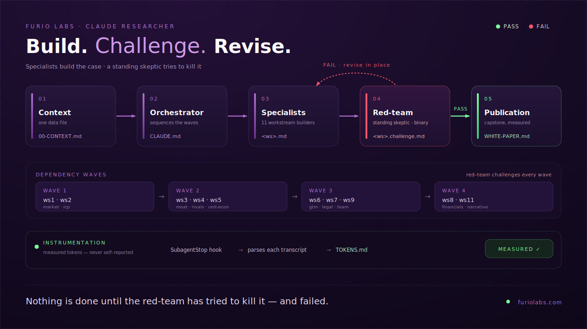

# Swarm Foundry — Business-Case Build + Challenge Swarm

> Part of the **Market Swarm** product — and an open-source lab for agent-swarm experimentation.

A drop-in `.claude/` scaffold that builds and red-teams a **VC-grade business case for any
venture**, using a team of subagents with per-task model routing. You bring the idea and the
facts; the swarm builds the case and a standing skeptic tries to kill it.

  

It is domain-agnostic: the entire business lives in **one data file**
(`docs/business-model/00-CONTEXT.md`). Fill that in and the eleven specialist agents take their
domain from it.

> 📐 **New here?** The [`wiki/`](wiki/Home.md) explains it with rendered architecture and flow
> diagrams ([Architecture](wiki/Architecture.md) · [Workflow](wiki/Workflow.md)).

## Install
1. Copy the **contents of this folder** into the **root of a git repo** (so that `.claude/`,
   `docs/`, and `CLAUDE.md` sit at the repo root).
2. Open the repo in Claude Code: `claude`
3. **Provide your business data** — run `/new-case`. It interviews you, web-researches the
   domain, and drafts `docs/business-model/00-CONTEXT.md` with sources for you to confirm.
   `/new-case` is the **only** supported way to start a case (it also resets the per-case token
   ledger so each case is measured from zero). The `*.template.md` files are the interview's
   field guide — don't hand-edit them into `00-CONTEXT.md`.
4. **Answer the Human Gates** in `00-CONTEXT.md` before running anything that depends on them.
   Agents are forbidden from inventing these.
5. Restart the session after adding/editing agent files (they load at session start).

## Run
- `/new-case`            → interview + research → draft `00-CONTEXT.md` for your confirmation.
- `/gate-check`          → confirms the Human Gates are answered; refuses to proceed if not.
- `/run-wave 1`          → runs Wave 1 builders in parallel, then red-teams each, then revises.
- `/run-wave 2` … `4`    → subsequent waves (respect dependencies; don't skip).
- `/build-ws ws3`        → run a single workstream end-to-end (build → challenge → revise).
- `/redteam`             → re-run the standing skeptic across all current artifacts + a bear case.
- `/publish`             → capstone: white paper + post from the MEASURED token ledger.

Outputs land in `docs/business-model/<ws-id>.md`, critiques in `<ws-id>.challenge.md`,
progress in `STATUS.md`.

## What `/new-case` captures (`00-CONTEXT.md`)
The single data file carries the **domain frame** the agents interpolate:
- the business + committed decisions + the wedge
- product category, customer unit, segments/geographies + staging, why-now driver,
  commodity layer, jurisdiction, entity structure, candidate risks
- verified facts (claim + source URL + as-of date + confidence)
- the six canonical Human Gates (you answer; never guessed)

## Model routing (why each agent runs where it does)
- **opus** — heavy reasoning / adversarial: ws3 (moat), ws5 (unit economics),
  ws8 (financials), the red-team, and the publication-writer (capstone). A weak skeptic
  passes weak assets, so the challenger gets the strongest model.
- **sonnet** — research+synthesis (ws1, ws2, ws4, ws7) and structured drafting
  (ws6, ws9, ws11). Research agents carry WebSearch/WebFetch.
- Cost lever: set `CLAUDE_CODE_SUBAGENT_MODEL` to change the default, or downgrade
  ws9/ws11 to `haiku` to trim tokens. Expect several× the tokens of a single-threaded run
  (`[ASSUMPTION]` — varies by case; cross-check with `/cost`).

## The one rule that makes this worth running
Nothing is "done" until the **red-team-partner** has tried to kill it and failed, OR the
builder has logged an explicit rebuttal. No invented evidence — ever. Unsourced claims
presented as fact are an automatic FAIL.

## Prior art & how this differs
Several open-source projects orchestrate "swarms" of agents; each overlaps part of what this
scaffold does. What's distinct here is the *combination*: a Claude-Code-native, distributable
template that builds a **founder's own** business case under hard evidence rules, gated by a
**binding** red-team verdict, with **measured** (transcript-parsed) token instrumentation.

| Project | What it is | Closest overlap |
|---|---|---|
| [metaswarm](https://github.com/dsifry/metaswarm) | Claude Code framework for the software lifecycle (issue→PR) with an adversarial-review phase | Structure: orchestrator + specialist agents + a binding adversarial gate |
| [dealscout](https://github.com/AKMessi/dealscout) | Python/LangGraph app where agents analyze a startup and emit a Pass/Invest memo | Theme: adversarial venture diligence |
| [am-will/swarms](https://github.com/am-will/swarms) | Claude Code skills pack: plan → run tasks in parallel waves → verify | Mechanic: file-based coordination and dependency waves |
| [claude-flow](https://github.com/ruvnet/claude-flow) | Enterprise multi-agent orchestration platform | Lineage: large-scale agent swarms |

What this scaffold adds on top:
- **Founder-side and evidence-gated** — the agents build *your* case but may not invent
  evidence; every figure is sourced or tagged `[ASSUMPTION]` / `[NEEDS HUMAN INPUT]`.
- **A binding red-team gate** — a standing skeptic must fail to kill a deliverable (or a
  rebuttal is logged) before it counts, and it judges each re-review fresh, without anchoring
  on its prior critique.
- **Measured token instrumentation** — hooks read each subagent's own transcript; agents never
  self-report usage.

_Design notes adapted from prior art: the fresh-reviewer / anti-anchoring rule and cited-evidence
verdicts are inspired by metaswarm's adversarial review._

## Instrumentation & documentation
The swarm self-documents and self-measures:
- `SubagentStop` hook → `.claude/hooks/log-subagent.js` parses each subagent's transcript and
  records **measured** tokens + cost to `docs/business-model/TOKENS.md` / `TOKENS.jsonl`.
- `Stop` hook → `snapshot-tokens.js` writes `TOKENS-SUMMARY.md`.
- `SessionStart` hook → stamps `RUN-LOG.md`.
- `/publish` runs `publication-writer` to produce `WHITE-PAPER.md` + `SUBSTACK-POST.md` from the
  REAL ledger.

### Dependencies & gotchas
- **Node.js only** — the hooks are Node scripts (Claude Code already requires Node). No `jq`.
- **Hooks and settings load at session start** — start a fresh `claude` session after copying
  this in (and restart if you edit hooks/agents).
- **Token usage is read from the transcript.** `agent_transcript_path` requires a reasonably
  recent Claude Code build; if your version omits it, the hook records `0` — fall back to
  `/cost`. Always sanity-check the ledger total against Claude Code's own `/cost`.
- Cost numbers use standard rates; with caching/batch, effective cost is lower.
