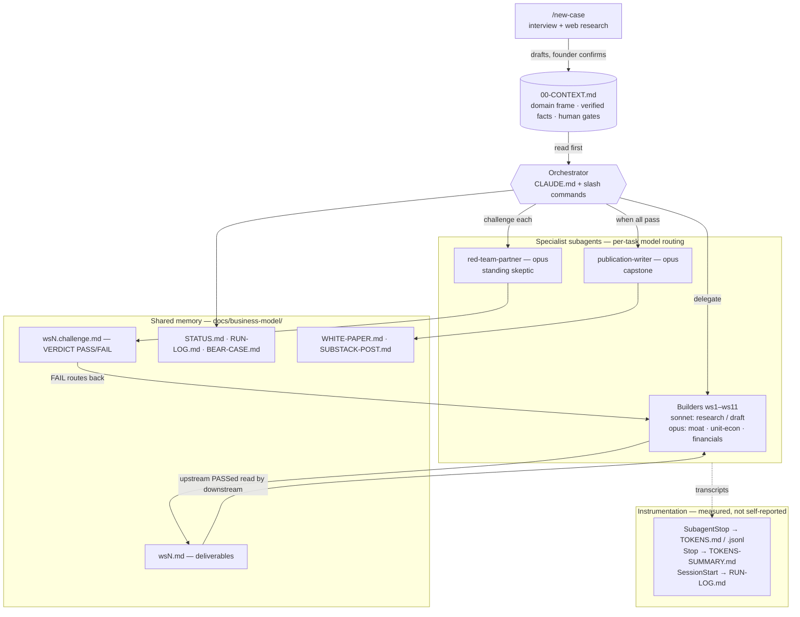

# Architecture

Agents never talk to each other. They coordinate through **files** in
`docs/business-model/` (shared memory), the **orchestrator** sequences them, and **hooks**
measure token cost from each subagent's own transcript.

## Components

| Component | What it is |
|---|---|
| **`00-CONTEXT.md`** | The single data file you complete. Carries the **domain frame** (product category, customer unit, segments + staging, why-now driver, commodity layer, jurisdiction, entity structure, candidate risks), the **verified facts** (each with a source URL), and the **Human Gates**. Every agent reads it first and takes its domain from these slots — that's what makes the swarm generic. |
| **Orchestrator** | The main Claude Code session, driven by `CLAUDE.md` and the slash commands. Sequences waves, runs the build→challenge→revise loop, updates the status board. It does not do workstream work itself. |
| **Builders (ws1–ws11)** | One specialist per analytical dimension: market, ICP/JTBD, product/moat, competition, unit-econ, GTM, compliance/legal, team/FMF, financials, narrative. Each writes `wsN.md`. |
| **red-team-partner** | A standing skeptical Series A partner whose job is to *kill* each deliverable. Writes `wsN.challenge.md` ending in `VERDICT: PASS\|FAIL`; seeds its kill-shots from `candidate_risks`. |
| **publication-writer** | Capstone. Reads every passed artifact + the measured ledger and writes the white paper and post — using real numbers only. |
| **Shared memory** | The `docs/business-model/*.md` files. Builders read upstream PASSed deliverables (e.g. ws8 reads ws5 + ws6; ws11 reads all) so downstream analysis reconciles instead of guessing. |
| **Hooks** | `SubagentStop` parses each subagent's transcript for real token usage → `TOKENS.md`; `Stop` rolls up `TOKENS-SUMMARY.md`; `SessionStart` stamps `RUN-LOG.md`. **Agents never write token numbers** — the cost ledger is measured. |

## Model routing
The challenger gets the strongest model on purpose — a weak skeptic passes weak assets.
**opus** runs the adversarial / quantitative work (ws3 moat, ws5 unit-econ, ws8 financials,
red-team, publication); **sonnet** runs research and structured drafting (ws1, ws2, ws4, ws6,
ws7, ws9, ws11). Override with `CLAUDE_CODE_SUBAGENT_MODEL`.
