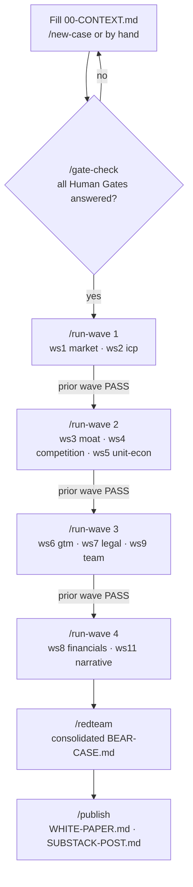

# Claude Researcher — Wiki

A drop-in Claude Code swarm that **builds a VC-grade business case for any venture and then
tries to kill it.** You supply the idea and the facts in one data file
(`docs/business-model/00-CONTEXT.md`); a team of specialist subagents builds the case, and a
standing skeptic red-teams every piece until it survives or carries a logged rebuttal.

## At a glance

## Pages
- **[Architecture](Architecture.md)** — components, shared-memory files, model routing, instrumentation.
- **[Workflow](Workflow.md)** — the build→challenge→revise loop and the dependency-wave DAG.

## Quick start
1. Copy the **contents** of this bundle into the root of a git repo.
2. Run **`/new-case`** (interview + web research → drafts `00-CONTEXT.md` for your confirmation),
   or fill `docs/business-model/00-CONTEXT.template.md` by hand.
3. `/gate-check` → `/run-wave 1…4` → `/redteam` → `/publish`.

## The one rule
Nothing is "done" until **red-team-partner** has tried to kill it and failed, or the builder has
logged an explicit rebuttal. No invented evidence — every figure is sourced (URL) or tagged
`[ASSUMPTION]` / `[NEEDS HUMAN INPUT]`.
