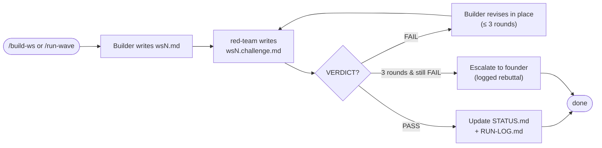
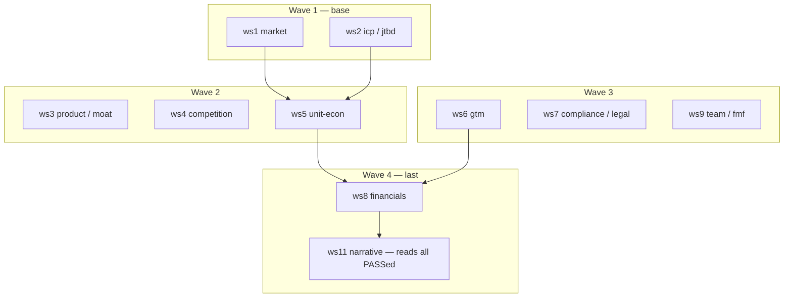

# Workflow

## The build → challenge → revise loop (per workstream)

Every workstream runs the same cycle. A deliverable is only accepted on `PASS`, or after a
capped number of revision rounds with a logged rebuttal.

## Dependency waves

Workstreams are grouped into four waves. **A wave starts only when the prior wave is
PASS/rebutted; within a wave, builders run concurrently.** The arrows are the real data reads —
e.g. ws5 carries ws1/ws2 inputs, ws8 reconciles against ws5 + ws6, and ws11 synthesizes only
from artifacts that passed the red team.

> **red-team-partner is continuous** — it challenges *every* workstream in every wave (it is the
> implicit "ws10"). It is omitted from the arrows above only to keep the dependency picture
> readable.

## Capstone

After all waves pass, `/redteam` writes the consolidated `BEAR-CASE.md` (the strongest memo
*against* funding), then `/publish` runs `publication-writer` to produce `WHITE-PAPER.md` and
`SUBSTACK-POST.md` from the **measured** token ledger — `[NO DATA]` wherever a figure is missing,
never an estimate.
